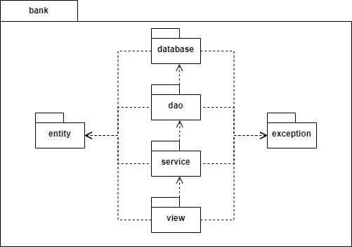
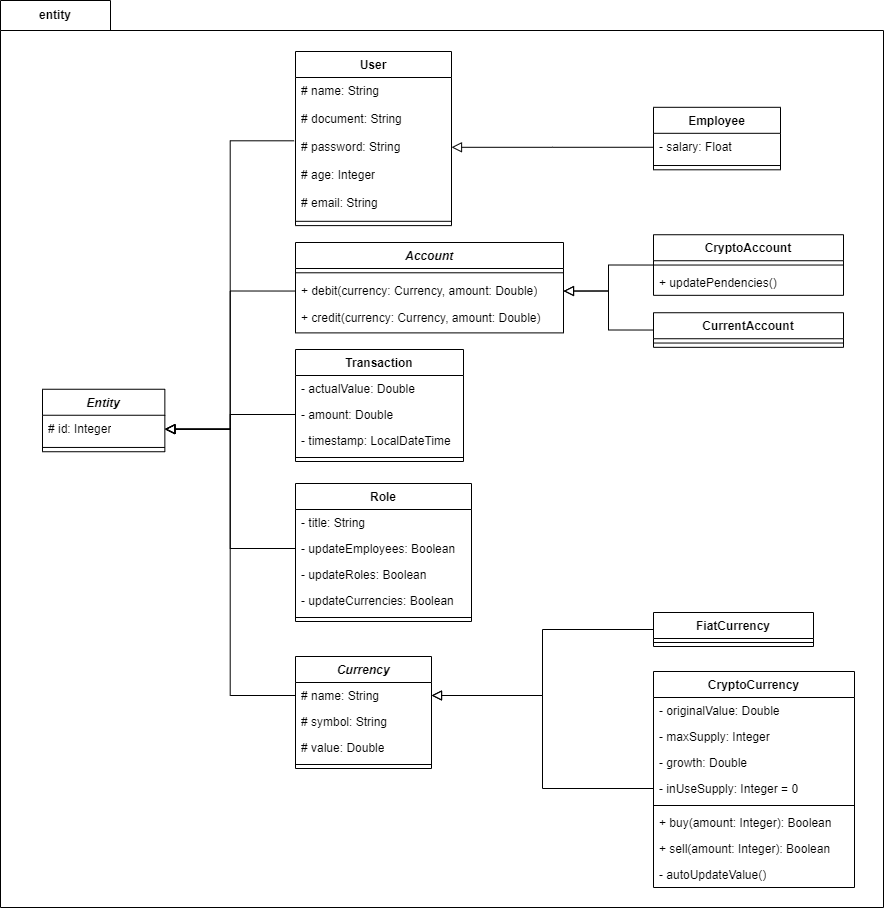
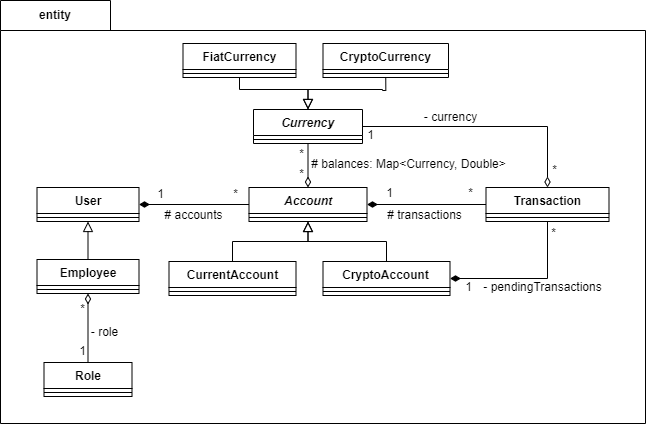
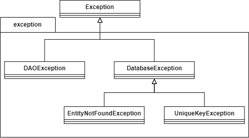
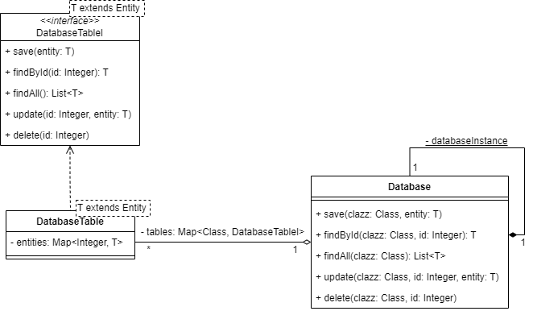
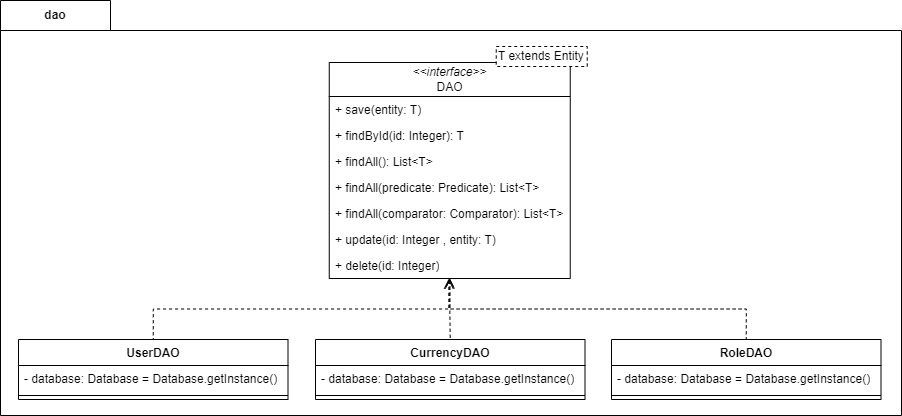

# Projeto Banco Digital com Recursos para Criptomoedas

## Sumário

1. [Introdução](#introdução)
2. [Contexto do Projeto](#contexto-do-projeto)
3. [Fluxo de Uso](#fluxo-de-uso)
4. [Diagramas do Projeto](#diagramas-do-projeto)
   - [Diagrama de Pacotes](#diagrama-de-pacotes)
   - [Diagrama de Classes do Pacote Entidade](#diagrama-de-classes-do-pacote-entidade)
   - [Diagrama de Classes do Pacote Exception](#diagrama-de-classes-do-pacote-exception)
   - [Diagrama de Classes do Pacote Database](#diagrama-de-classes-do-pacote-database)
   - [Diagrama de Classes do Pacote DAO](#diagrama-de-classes-do-pacote-dao)
5. [Status dos Pacotes Service e View](#status-dos-pacotes-service-e-view)
6. [Documentos de Requisitos](#documentos-de-requisitos)

## Introdução

Este documento apresenta a estrutura de um projeto de banco digital com recursos para criptomoedas. As funcionalidades incluem a criação de contas, compra de moedas, transferências e outras operações bancárias básicas. O projeto é desenvolvido com uma arquitetura modular que permite fácil manutenção e expansão.

## Contexto do Projeto

O projeto é um sistema bancário digital que oferece suporte tanto para moedas fiduciárias quanto para criptomoedas. O sistema permite aos usuários criar contas bancárias tradicionais e carteiras de criptomoedas, realizar depósitos, saques, transferências e conversões entre diferentes tipos de moedas. Além disso, o sistema inclui uma interface para funcionários do banco, que podem gerenciar funcionários e atualizar valores de moedas.

## Fluxo de Uso

1. **Login ou Criação de Usuário**:
   - O usuário pode optar por fazer login se já tiver uma conta ou criar uma nova conta fornecendo informações como documento, senha, nome, idade e e-mail.

2. **Página de Contas**:
   - Após o login, o usuário é direcionado para a página de contas, onde pode visualizar suas contas correntes e carteiras de criptomoedas.

3. **Operações em Conta**:
   - **Depositar**: O usuário pode depositar dinheiro em sua conta corrente.
   - **Saque**: O usuário pode realizar saques de sua conta corrente.
   - **Transferir**: O usuário pode transferir fundos entre suas contas e para outras contas (tanto em dinheiro quanto em criptomoedas).
   - **Conversão**: O usuário pode comprar e vender criptomoedas.
   - **Histórico de Transações**: O usuário pode visualizar e filtrar seu histórico de transações.

4. **Página de Funcionário**:
   - Funcionários do banco podem acessar uma interface especial usando o mesmo login e senha.
   - **Gerenciamento de Contas**: Funcionários podem criar, atualizar e excluir contas de funcionários.
   - **Gerenciamento de Moedas**: Funcionários podem adicionar novas moedas (fiduciárias e cripto) e atualizar os valores das moedas fiduciárias.

## Diagramas do Projeto

### Diagrama de Pacotes

### Diagrama de Classes do Pacote Entidade

#### Diagrama de Hierarquia

#### Diagrama de Relação

### Diagrama de Classes do Pacote Exception

### Diagrama de Classes do Pacote Database

### Diagrama de Classes do Pacote DAO

## Status dos Pacotes Service e View

Os diagramas dos pacotes Service e View ainda estão em fase de construção. Estes pacotes são essenciais para a implementação da lógica de negócios e da interface de usuário do sistema.

- **Pacote Service**: Contém a lógica de negócios e os serviços que coordenam a operação entre o DAO e a View.
- **Pacote View**: Responsável pela interação com o usuário.

Os diagramas desses pacotes serão incluídos em versões futuras do documento assim que estiverem completos.

## Documentos de Requisitos

- [Requisitos Funcionais](requeriments/functional.pdf)
- [Requisitos Não Funcionais](requeriments/non-functional.pdf)

## Conclusão

Este documento apresentou a estrutura inicial do projeto, detalhando os principais pacotes e suas classes. A arquitetura foi projetada para ser modular e expansível, permitindo futuras melhorias e adições de funcionalidades. Continuamos trabalhando nos pacotes Service e View para completar a implementação do sistema.

Para mais informações e atualizações, consulte os repositórios e a documentação do projeto.